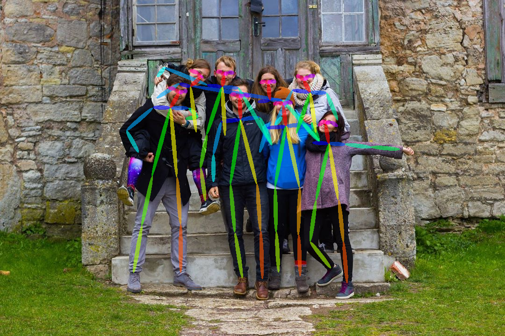

# Video Pose Extractor #
*"Nature is a language can't you read?" - The Smiths*

Dockerized, minimal implementation of Cao et al.'s [repository](https://github.com/ZheC/Realtime_Multi-Person_Pose_Estimation) including Caffe, OpenCV and Python 2.7.

Includes:
- CPU Caffe implementation
- python bindings + OpenCV for happy hacking
- easy-to-use video-to-images script for pose finding in videos
- dump limb data into a file for later analysis and modeling

## Demo



## Getting started

[Install Docker](https://www.docker.com/community-edition#/download)

From the command line:

`docker pull justinshenk/pose-extractor`

followed by 

`docker run -it -v $(pwd):/root/notebook --name pose justinshenk/pose-extractor`

or build it locally

```bash
git clone https://github.com/justinshenk/video-pose-extractor.git
cd video-pose-extractor
docker build -t justinshenk/pose-extractor:cpu .
```

### Image ###

`python convert.py -i [image]`

### Video ###

`python convert.py -i [input_file] -s [start_time] -t [duration] -r [frame_rate]`

Note: Time is in `hh:mm:ss` format.

Data is saved in `positions.npy` and can be loaded using

```
ipython
import numpy as np
raw = np.load('positions.npy')
data = raw.take(0)
```
